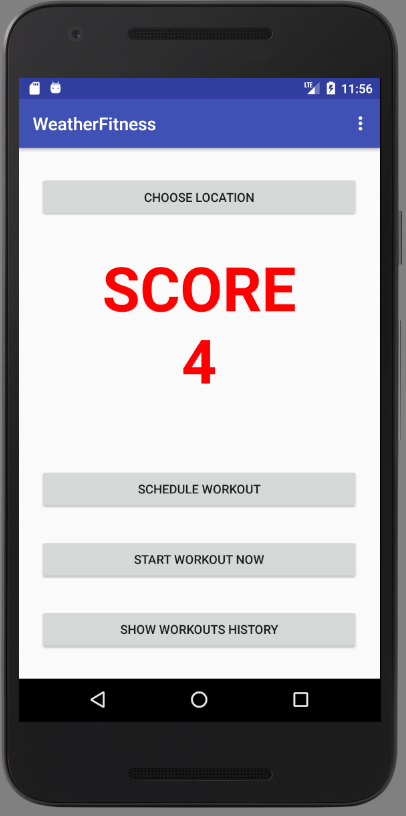
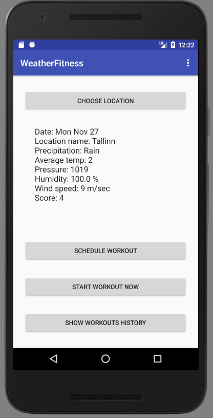
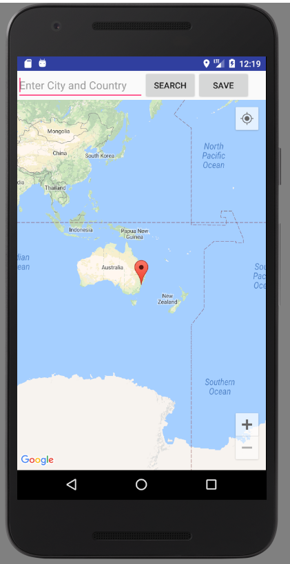
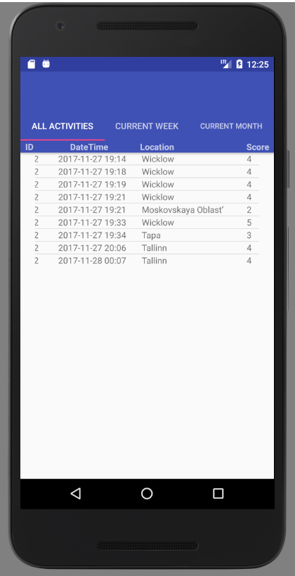
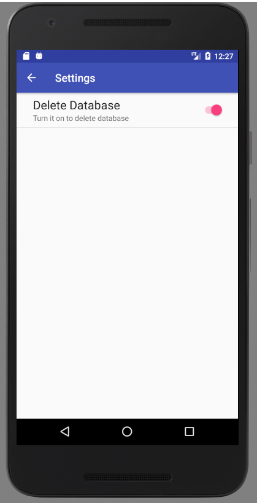

# WeatherFitness App
UCD project to create an Android application as an Assignment for COMP41690 Practical Android Programming 2017-2018 module.

The app will provide a score for day/time based on algorithm which evaluates temperature, humidity, wind speed, precipitation. 
App is using GPS, Calendar, Maps, weather web service, SQLLite to store app related information. 

